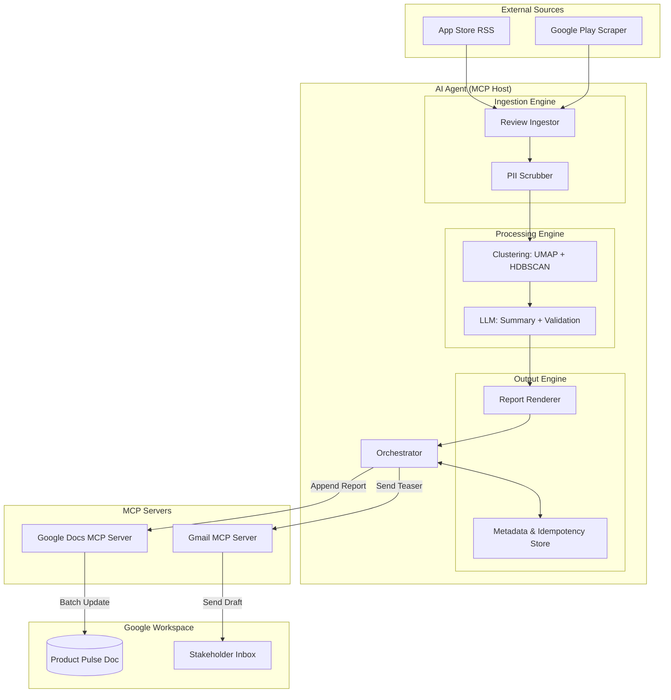

# Weekly Product Review Pulse — Architecture

This document outlines the technical architecture for the Weekly Product Review Pulse agent. The system is designed as an AI agent that acts as an MCP host, delegating Google Workspace interactions to dedicated MCP servers.

## High-Level System Diagram

## Component Breakdown

### 1. AI Agent (Orchestrator)
The central logic that manages the lifecycle of a "pulse" run. It handles:
- **CLI Interface:** Triggering runs for specific products and weeks.
- **State Management:** Tracking which phase of the pipeline is active.
- **MCP Client:** Connecting to and invoking tools on the Google Docs and Gmail MCP servers.

### 2. Ingestion Engine
- **App Store Ingestor:** Polls iTunes RSS feeds for recent reviews.
- **Google Play Ingestor:** Uses a scraper or API to fetch recent reviews.
- **PII Scrubber:** A regex/LLM-based filter to remove names, phone numbers, and emails from review text before it reaches the processing stage.

### 3. Processing Engine
- **Clustering:** 
  - Converts reviews into embeddings (e.g., OpenAI/Gemini embeddings).
  - Uses UMAP for dimensionality reduction and HDBSCAN for density-based clustering.
- **LLM Refiner:**
  - Names themes based on cluster centroids.
  - Selects representative quotes and validates them against the original source text.
  - Proposes actionable insights based on the themes.

### 4. Output Engine
- **Report Renderer:** Generates two formats:
  - **Structural Data:** For the Google Doc `batchUpdate` (headings, lists, text).
  - **HTML/Plain Text:** For the Gmail teaser.
- **Metadata Store (SQLite):**
  - Stores `run_id`, `product_id`, `iso_week`, `doc_section_id`, and `gmail_message_id`.
  - Ensures **Idempotency**: Checks if a run for a specific product/week already exists before triggering delivery.

### 5. MCP Layer
- **Google Docs MCP Server:**
  - Tool: `append_section(document_id, content, header_text)`
  - Encapsulates OAuth flow and Docs API complexities.
- **Gmail MCP Server:**
  - Tool: `send_teaser(recipient, subject, body, doc_link)`
  - Handles email formatting and delivery.

## Data Flow & Idempotency

1.  **Trigger:** CLI starts run for `Groww`, Week `2026-W18`.
2.  **Check:** Orchestrator queries Metadata Store. If `Groww / 2026-W18` exists, abort or prompt for overwrite.
3.  **Process:** Ingest -> Scrub -> Cluster -> Summarize.
4.  **Delivery (Doc):**
    - Call `google-docs-mcp` to append a new section.
    - Receive confirmation and a stable link/ID for the new heading.
5.  **Delivery (Gmail):**
    - Construct email with the deep link to the Doc section.
    - Call `gmail-mcp` to send.
6.  **Finalize:** Record IDs in Metadata Store.

## Security & Privacy
- **No Credentials in Agent:** All Google OAuth tokens reside within the MCP server environments.
- **PII Scrubbing:** Reviews are sanitized early in the pipeline.
- **Local Isolation:** Raw review data is stored temporarily and not exposed to the public internet.

## Technology Stack
- **Language:** Python (or Node.js, depending on library preference for clustering).
- **Embeddings/LLM:** OpenAI or Google Gemini.
- **Clustering:** `scikit-learn`, `umap-learn`, `hdbscan`.
- **MCP Host:** `mcp` SDK.
- **Database:** SQLite for lightweight metadata tracking.
